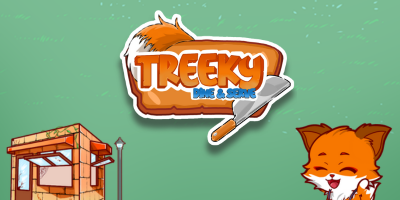
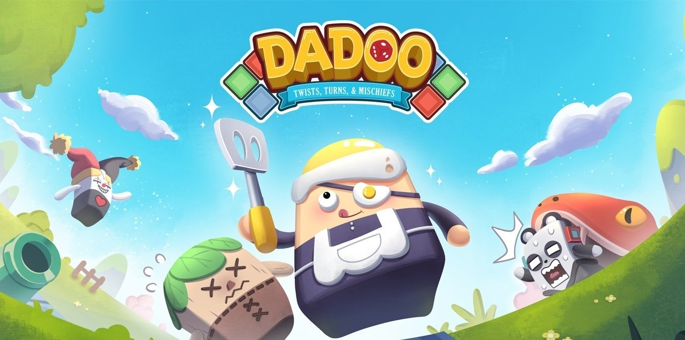
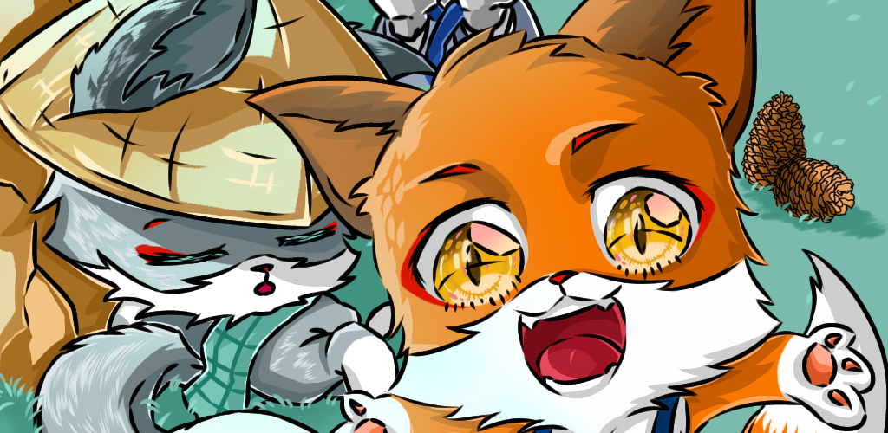

## Hi there, Imam Noerhenda here~ 😎 

<!--
**imamnoerhenda17/imamnoerhenda17** is a ✨ _special_ ✨ repository because its `README.md` (this file) appears on your GitHub profile.

Here are some ideas to get you started:

- 🔭 I’m currently working on ...
- 🌱 I’m currently learning ...
- 👯 I’m looking to collaborate on ...
- 🤔 I’m looking for help with ...
- 💬 Ask me about ...
- 📫 How to reach me: ...
- 😄 Pronouns: ...
- ⚡ Fun fact: ...
-->

   

### Glad to see you here!
I'm passionate about crafting games and exploring new technologies that push the boundaries of game development. For me, games are more than just entertainment—they're powerful medium to tell stories and share meaningfull experiences with people around the world.

I began my journey in game development back in 2020, starting with a replica of an
[Autonomous Driving Car](#autonomous-driving-car), and later diving into small-scale game projects. I primarily use Unity as my game engine, and it's been my go-to tool ever since.

Over the years, I've had the opportunity to collaborate with several game studios, learning the ins and outs of professional game production. These experiences have shaped how I approach development today.

Currently, I'm building games at Skypillar Studio, but I'm always open to exciting new collaborations. If you're interested in working together or just want to connect—feel free to reach out!

<h2 align="center">Skill Mastery</h2>

  

 

<h2 align="center">Archived Quests</h2>

  

### Treeky: Dine & Serve

A game about little fox that have a dream to rebuild his restaurant and bringing joy to every customer who walks through the door.

My contribution for this games are :
- Designing the Game
- Manage the Production Process
- Almost 90% of the Programming & Publishing Task

 

##

 

  

### Dadoo - Board, Card and Chaos

Dadoo is an online multiplayer party board game with superpowers and lots of mischief!

My contribution for this game are :
- Code for cards ability
- Implementation some character skin
- Creating a camera tracking function

 

##

 

  

### Autonomous Driving Car

It is an experiment about a Car that try to learn to find its way out using Machine Learning technique which is Reinforment Learning

My contribution for this experiment are :
- Train the Car using Machine Learning
- Design the track for the car
- Analyze the result of training

<!-- <table>
  <tr>
    <td style="border: none;" width="50%">
      
      
<strong>Item 1:</strong> Description goes here.

    </td>
    <td style="border: none;" width="50%">
      
      
<strong>Item 2:</strong> Another description.

    </td>
  </tr>
</table> -->
